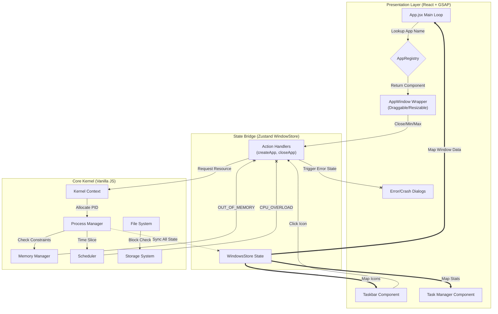

# 🧠 WebOS - Simulated Operating System in the Browser

## _A futuristic, research-grade OS… built with frontend tools. Because why not?_

WebOS is a full operating system simulation implemented entirely in the browser.
It models fundamental OS subsystems — process management, memory allocation, CPU scheduling, file systems, and storage — built using React, Zustand, GSAP, and a custom kernel architecture.
This project is designed to bridge theory and practice, allowing students and developers to observe how low-level mechanisms behave under realistic constraints. The architecture models core OS principles such as:

* Round Robin scheduling
* First-Fit memory allocation
* Fragmentation handling
* Block-based disk storage
* Hierarchical file system traversal
* Kernel-led resource arbitration

All system interactions occur through a **kernel-first control flow**, ensuring strict separation of the computational model and UI rendering.

---

## 🏗️ System Architecture

This project is architected into three distinct layers to mimic real-world OS design. The **Zustand Store** acts as an "Authoritative Cache," synchronizing the high-speed UI with the low-level Kernel logic.
* WebOS is built on a Kernel → Store → UI pipeline.
* The UI is NEVER allowed to guess system state.
* Everything goes through the kernel first.

Below is the entire system in one diagram — the brain of WebOS:

## ⚙️ Technical Deep Dive

### 1. The Custom Kernel

#### 📦 MemoryManager
- Implements **First-Fit Allocation**
- Handles **Fragmentation Tracking**
- Allocates and frees memory blocks dynamically based on process requirements

#### ⏱️ Scheduler
- Implements **Round Robin CPU Scheduling**
- Allocates CPU time in cycles (quanta)
- Simulates CPU overload and decay (usage drops over time if idle)

#### 💾 StorageSystem
- **Block-Based Storage Architecture**
- Manages raw storage blocks and interfaces with file system for low-level I/O
- Mimics real-world disk layout principles

#### 📁 FileSystem
- Implements **Nested Hierarchical File Structure**
- Supports folders, files, and nested traversal
- File operations are backed by simulated block-level storage

#### 🧩 ProcessManager
- Creates, terminates, and tracks all app processes
- Coordinates with memory and scheduler to maintain process states (`ready`, `running`, `waiting`)

### 2. The Rendering Engine (Registry Pattern)

- **App Registry:** Maps app identifiers (“Terminal”, “Calculator”) to React components.
  
- **Window Factory:** App loop listens to `windowStore` and mounts apps dynamically.
  
- **The Wrapper (`AppWindow`):** The resolved component is injected into a generic `<AppWindow />` wrapper. This wrapper handles all the "OS-level" behavior—dragging, resizing (via `react-rnd`), closing, and minimizing—while the app component inside remains purely functional and isolated.

### 3. System Resilience & Error Simulation

Unlike standard web apps that have infinite virtual memory, WebOS enforces strict, realistic resource constraints managed by the Kernel. The system implements a robust error-handling pipeline:

- 🔥 **CPU Overload:** If the total CPU usage of active processes approaches 100%, the Scheduler throttles new process creation and the Kernel throws a CPU_OVERLOAD error, preventing system instability.
  
- 🧠 **Out of Memory (OOM):** The Memory Manager tracks available blocks. If an app requests more memory than available (fragmentation or full usage), the Kernel denies the PID allocation, triggering an OOM Crash simulation in the UI.
  
- 💾 **Out of Storage:** The File System calculates block usage on the virtual disk. Attempting to save a file when blocks are full triggers a write failure, requiring the user to delete files to free up space.

---

## ⚡ Key Features

- 🚀 **Real-Time Process Simulation**  
  Launch multiple apps in parallel with individual CPU + memory consumption.

- 🧠 **Simulated Kernel**  
  Core modules handle scheduling, memory, file I/O, and process lifecycle — all with resource logic and constraints.

- 📊 **Live System Stats**  
  Hidden developer panel reveals active processes, memory map, CPU usage, and app status in real-time.

- 🪟 **Windowing System**  
  Built using `react-rnd`, it supports dragging, resizing, minimizing, maximizing, and z-index focus — all animated with GSAP.

- 🧩 **Fully Modular Architecture**  
  Everything is split into modules with shared access through a global `kernelContext` for clean control.

- 🔧 **Error Handling for CPU/Memory Overload**  
  Realistic constraints simulate real OS behavior under heavy load.

---

## 🧰 Tech Stack

| Layer            | Tech                               |
|------------------|------------------------------------|
| UI Layer         | React, GSAP, CSS Modules, Framer   |
| App Interaction  | Zustand (state mgmt)               |
| OS Kernel Logic  | Pure JavaScript (modular)          |
| Window System    | react-rnd + GSAP                   |

---

## 🎯 Project Goals

- Help students understand OS concepts through **visual, interactive simulation**
- Make the internal workings of a kernel **transparent and accessible**
- Provide a sandbox for experimentation (create apps, test overload, visualize memory, etc.)

---

## 📦 Under Construction

- [ ] 🪄 **Task Manager App** (kill processes)
- [ ] 💻 **Terminal Emulator**
- [ ] 📁 **UI/UX FileSystem**
- [ ] 🎨 **Full UI/UX Overhaul** after core features are finalized
- [ ] 🧠 **4th Wall Apps** – playful and futuristic interactions
- [ ] 🔐 **Access Control + User Simulation**
- [ ] 🧠 **AppStore-Like Installer** for modular apps

---

## 🏁 Current Status

✅ Kernel Module Integration  
✅ Process Lifecycle Management  
✅ CPU & Memory Constraints + Errors  
✅ Multitasking + Window System  
✅ Task-Manager (process stats view)  
✅ Taskbar 

---

## 🧠 Why This Matters

> “OS dev isn’t about the GUI — it’s about the guts.”  

WebOS is one of the few browser-based projects that simulates actual OS behavior, not just the appearance of one.

It teaches by simulation.  
It scales by architecture.  
It impresses by depth.

---

## 🤝 Contributors

- [Mukund]
- [Abhivansh]

---

## 📸 Demo (coming soon)

> Live Demo, Video Walkthrough, and Code Tour will be added post-feature freeze.

---

## 📜 License

MIT — free to use, modify, and build on.

---

