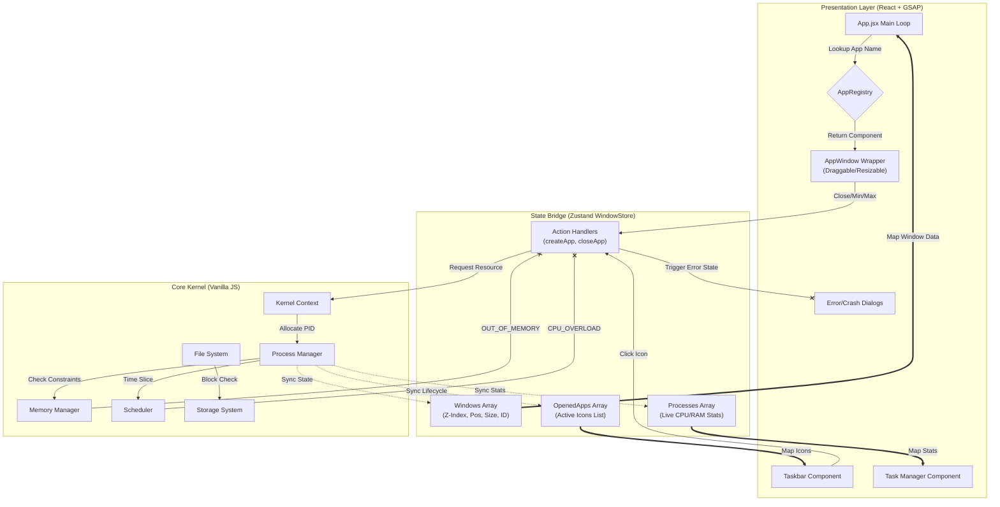

# 🧠 WebOS - Simulated Operating System in the Browser

A fully functional, **browser-based operating system simulation** built with **React**, **Zustand**, **GSAP**, and a custom-made **kernel architecture**. This isn’t just a styled window manager — it mimics how real operating systems manage memory, processes, storage, and scheduling.  

Designed to help students **visualize OS internals**, explore resource constraints, and run multitasking apps inside a fully interactive system — right from their browser.

---

## ⚡ Key Features

- 🚀 **Real-Time Process Simulation**  
  Launch multiple apps in parallel with individual CPU + memory consumption.

- 🧠 **Simulated Kernel**  
  Core modules handle scheduling, memory, file I/O, and process lifecycle — all with resource logic and constraints.

- 📊 **Live System Stats**  
  Hidden developer panel reveals active processes, memory map, CPU usage, and app status in real-time.

- 🪟 **Windowing System**  
  Built using `react-rnd`, it supports dragging, resizing, minimizing, maximizing, and z-index focus — all animated with GSAP.

- 🧩 **Fully Modular Architecture**  
  Everything is split into modules with shared access through a global `kernelContext` for clean control.

- 🔧 **Error Handling for CPU/Memory Overload**  
  Realistic constraints simulate real OS behavior under heavy load.

---

## 🧠 Simulated Kernel Modules

### 📦 MemoryManager
- Implements **First-Fit Allocation**
- Handles **Fragmentation Tracking**
- Allocates and frees memory blocks dynamically based on process requirements

### ⏱️ Scheduler
- Implements **Round Robin CPU Scheduling**
- Allocates CPU time in cycles (quanta)
- Simulates CPU overload and decay (usage drops over time if idle)

### 💾 StorageSystem
- **Block-Based Storage Architecture**
- Manages raw storage blocks and interfaces with file system for low-level I/O
- Mimics real-world disk layout principles

### 📁 FileSystem
- Implements **Nested Hierarchical File Structure**
- Supports folders, files, and nested traversal
- File operations are backed by simulated block-level storage

### 🧩 ProcessManager
- Creates, terminates, and tracks all app processes
- Coordinates with memory and scheduler to maintain process states (`ready`, `running`, `waiting`)

---

## 🧰 Tech Stack

| Layer            | Tech                               |
|------------------|------------------------------------|
| UI Layer         | React, GSAP, CSS Modules, Framer   |
| App Interaction  | Zustand (state mgmt)               |
| OS Kernel Logic  | Pure JavaScript (modular)          |
| Window System    | react-rnd + GSAP                   |

---

## 🎯 Project Goals

- Help students understand OS concepts through **visual, interactive simulation**
- Make the internal workings of a kernel **transparent and accessible**
- Provide a sandbox for experimentation (create apps, test overload, visualize memory, etc.)

---

## 📦 Under Construction

- [ ] 🪄 **Task Manager App** (kill processes, view stats)
- [ ] 💻 **Terminal Emulator**
- [ ] 📁 **UI/UX FileSystem**
- [ ] 🎨 **Full UI/UX Overhaul** after core features are finalized
- [ ] 🧠 **4th Wall Apps** – playful and futuristic interactions
- [ ] 🔐 **Access Control + User Simulation**
- [ ] 🧠 **AppStore-Like Installer** for modular apps

---

## 🏁 Current Status

✅ Kernel Module Integration  
✅ Process Lifecycle Management  
✅ CPU & Memory Constraints + Errors  
✅ Multitasking + Window System  
✅ Taskbar 
🚧 Task Manager (In Progress)  

---

## 🧠 Why This Matters

> “OS dev isn’t about the GUI — it’s about the guts.”  

Unlike basic to-do apps or dashboards, this project replicates the **under-the-hood systems** that power modern computing — but does so visually and interactively.  

It teaches by simulation.  
It scales by architecture.  
It impresses by depth.

---

## 🤝 Contributors

- [Mukund]
- [Abhivansh]

---

## 📸 Demo (coming soon)

> Live Demo, Video Walkthrough, and Code Tour will be added post-feature freeze.

---

## 📜 License

MIT — free to use, modify, and build on.

---

