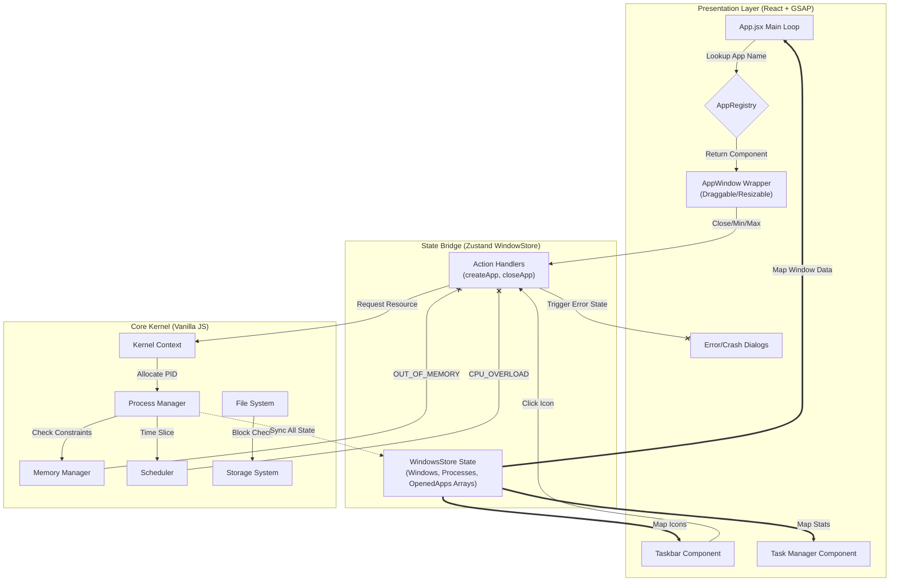

# 🧠 WebOS - Simulated Operating System in the Browser

A fully functional Research-Grade Operating System Simulation running entirely in the browser., **browser-based operating system simulation** built with **React**, **Zustand**, **GSAP**, and a custom-made **kernel architecture**. This isn’t just a styled window manager — it mimics how real operating systems manage memory, processes, storage, and scheduling.  

Designed to help students **visualize OS internals**, explore resource constraints, and run multitasking apps inside a fully interactive system — right from their browser.

---

## 📖 Overview
WebOS is not just a UI clone of a desktop environment. It is a comprehensive architectural simulation of an operating system kernel, bridging the gap between low-level systems programming and high-level web development.

The project implements core OS concepts—Round Robin Scheduling, Process Context Switching, Memory Pagination, and Block-Based Storage—written in pure JavaScript, driving a reactive User Interface built with React.

### 🌟 Core Philosophy: "The Kernel is King"
Unlike typical desktop simulations where the UI manages the state, this project utilizes a **"Kernel-First" Architecture**.
* The UI is strictly a **view layer**; it never guesses the system state.
* Every action (opening a window, saving a file) is a **request** sent to the Kernel.
* The UI only updates when the Kernel grants permission, allocates resources, and confirms the action.

---
## 🏗️ System Architecture

This project is architected into three distinct layers to mimic real-world OS design. The **Zustand Store** acts as an "Authoritative Cache," synchronizing the high-speed UI with the low-level Kernel logic.

## ⚙️ Technical Deep Dive

### The Custom Kernel

#### 📦 MemoryManager
- Implements **First-Fit Allocation**
- Handles **Fragmentation Tracking**
- Allocates and frees memory blocks dynamically based on process requirements

#### ⏱️ Scheduler
- Implements **Round Robin CPU Scheduling**
- Allocates CPU time in cycles (quanta)
- Simulates CPU overload and decay (usage drops over time if idle)

#### 💾 StorageSystem
- **Block-Based Storage Architecture**
- Manages raw storage blocks and interfaces with file system for low-level I/O
- Mimics real-world disk layout principles

#### 📁 FileSystem
- Implements **Nested Hierarchical File Structure**
- Supports folders, files, and nested traversal
- File operations are backed by simulated block-level storage

#### 🧩 ProcessManager
- Creates, terminates, and tracks all app processes
- Coordinates with memory and scheduler to maintain process states (`ready`, `running`, `waiting`)

### The Rendering Engine (Registry Pattern)
- **App Registry:** A central dictionary maps string identifiers (e.g., "Terminal", "Calculator") to their React Components
- **Window Factory:** The main App loop listens to the `windowStore`. When a new window is added to the state, it looks up the component in the Registry.
- **The Wrapper (`AppWindow`):** The resolved component is injected into a generic `<AppWindow />` wrapper. This wrapper handles all the "OS-level" behavior—dragging, resizing (via `react-rnd`), closing, and minimizing—while the app component inside remains purely functional and isolated.

### System Resilience & Error Simulation
Unlike standard web apps that have infinite virtual memory, WebOS enforces strict, realistic resource constraints managed by the Kernel. The system implements a robust error-handling pipeline:
- 🔥 **CPU Overload:** If the total CPU usage of active processes approaches 100%, the Scheduler throttles new process creation and the Kernel throws a CPU_OVERLOAD error, preventing system instability.
- 🧠 **Out of Memory (OOM):** The Memory Manager tracks available blocks. If an app requests more memory than available (fragmentation or full usage), the Kernel denies the PID allocation, triggering an OOM Crash simulation in the UI.
- 💾 **Out of Storage:** The File System calculates block usage on the virtual disk. Attempting to save a file when blocks are full triggers a write failure, requiring the user to delete files to free up space.

---

## ⚡ Key Features

- 🚀 **Real-Time Process Simulation**  
  Launch multiple apps in parallel with individual CPU + memory consumption.

- 🧠 **Simulated Kernel**  
  Core modules handle scheduling, memory, file I/O, and process lifecycle — all with resource logic and constraints.

- 📊 **Live System Stats**  
  Hidden developer panel reveals active processes, memory map, CPU usage, and app status in real-time.

- 🪟 **Windowing System**  
  Built using `react-rnd`, it supports dragging, resizing, minimizing, maximizing, and z-index focus — all animated with GSAP.

- 🧩 **Fully Modular Architecture**  
  Everything is split into modules with shared access through a global `kernelContext` for clean control.

- 🔧 **Error Handling for CPU/Memory Overload**  
  Realistic constraints simulate real OS behavior under heavy load.

---

## 🧰 Tech Stack

| Layer            | Tech                               |
|------------------|------------------------------------|
| UI Layer         | React, GSAP, CSS Modules, Framer   |
| App Interaction  | Zustand (state mgmt)               |
| OS Kernel Logic  | Pure JavaScript (modular)          |
| Window System    | react-rnd + GSAP                   |

---

## 🎯 Project Goals

- Help students understand OS concepts through **visual, interactive simulation**
- Make the internal workings of a kernel **transparent and accessible**
- Provide a sandbox for experimentation (create apps, test overload, visualize memory, etc.)

---

## 📦 Under Construction

- [ ] 🪄 **Task Manager App** (kill processes, view stats)
- [ ] 💻 **Terminal Emulator**
- [ ] 📁 **UI/UX FileSystem**
- [ ] 🎨 **Full UI/UX Overhaul** after core features are finalized
- [ ] 🧠 **4th Wall Apps** – playful and futuristic interactions
- [ ] 🔐 **Access Control + User Simulation**
- [ ] 🧠 **AppStore-Like Installer** for modular apps

---

## 🏁 Current Status

✅ Kernel Module Integration  
✅ Process Lifecycle Management  
✅ CPU & Memory Constraints + Errors  
✅ Multitasking + Window System  
✅ Taskbar 
🚧 Task Manager (In Progress)  

---

## 🧠 Why This Matters

> “OS dev isn’t about the GUI — it’s about the guts.” 

Unlike basic to-do apps or dashboards, this project replicates the **under-the-hood systems** that power modern computing — but does so visually and interactively.  

It teaches by simulation.  
It scales by architecture.  
It impresses by depth.

---

## 🤝 Contributors

- [Mukund]
- [Abhivansh]

---

## 📸 Demo (coming soon)

> Live Demo, Video Walkthrough, and Code Tour will be added post-feature freeze.

---

## 📜 License

MIT — free to use, modify, and build on.

---

